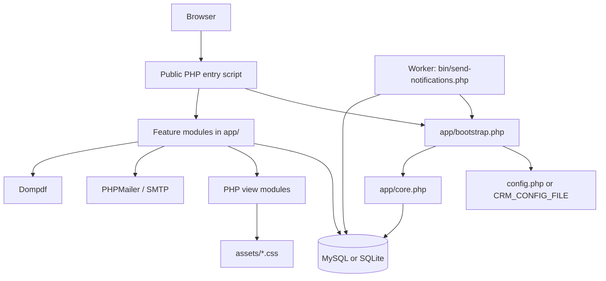
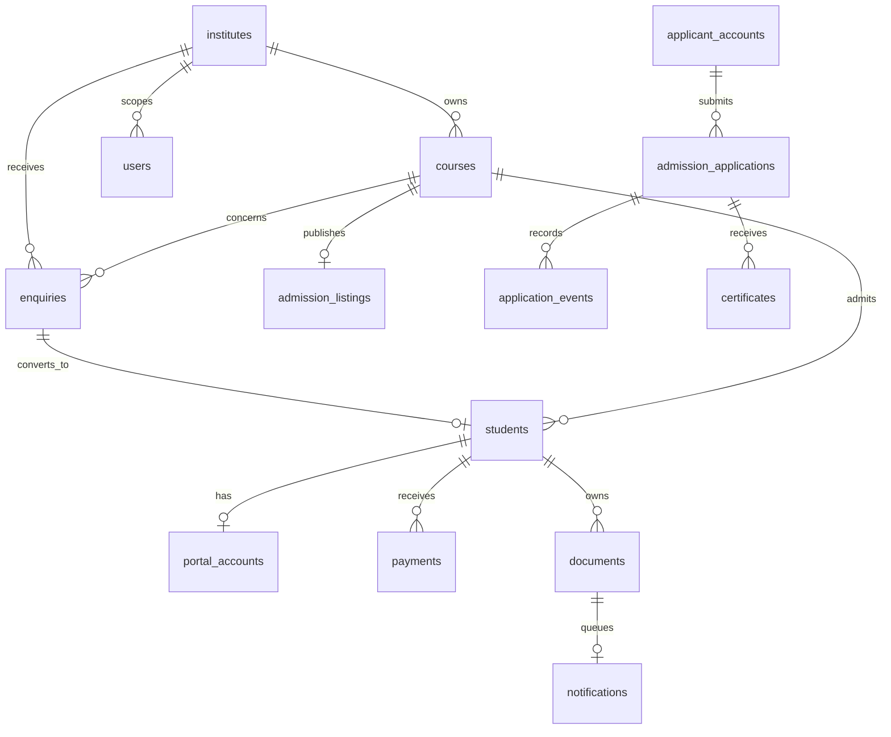
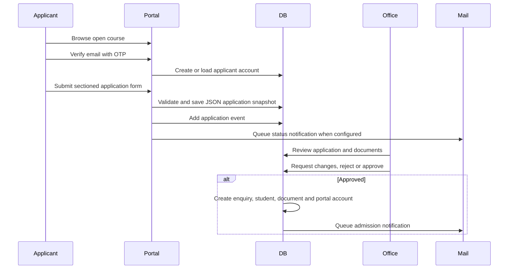

# Northstar Institute CRM: System Blueprint

This document is the working map for developers maintaining the Northstar Institute CRM. It describes the current architecture, request flows, data boundaries, security model, deployment model, and the safest places to add features.

## 1. Product Scope

Northstar is a PHP/MySQL educational CRM for one or more institutes. It combines:

- A public university-style website.
- Staff CRM operations for enquiries, courses, admissions, students, payments and documents.
- An applicant admissions portal.
- An enrolled-student portal.
- Email OTP authentication and notification delivery.
- Optional academic operations, student services, certificate automation and Razorpay payments.
- Browser setup, additive upgrades, health checks and release packaging.

The application is server-rendered PHP. There is no frontend build step and no SPA framework.

## 2. Runtime Architecture



### Main layers

| Layer | Location | Responsibility |
| --- | --- | --- |
| Entry points | Root `*.php` files | Start sessions, route requests, load modules, choose views |
| Bootstrap | `app/bootstrap.php` | Load configuration, timezone and core functions |
| Core | `app/core.php` | PDO connection, queries, escaping, sessions, CSRF helpers, access helpers |
| Domain modules | `app/*.php` | Authentication, admissions, portal, operations, services, payments, mail |
| Views | `app/*-views.php`, `app/views.php` | Render HTML and forms |
| Assets | `assets/` | CSS and small JavaScript files |
| Database | `app/schema.php`, `app/migrations.php` | Initial schema and additive feature migrations |
| CLI | `bin/` | Install, migrate, backup, health, workers and release build |
| Runtime/private files | `config.php`, `storage/` | Credentials, locks, setup key, SQLite, mail capture and runtime state |

## 3. Public Entry Points and Routes

| URL | Surface | Purpose |
| --- | --- | --- |
| `index.php` | Public website | Institute brand, courses, notices, faculty, contact and master sign-in |
| `student.php` | Student portal | Enrolled student access, applications, profile, payments and academic records |
| `apply.php` | Public applicant portal | Applicant sign-in, course catalogue, application submission and tracking |
| `office.php` | Staff CRM | Staff OTP sign-in and staff workspace |
| `setup.php` | First-install wizard | Creates a new empty installation and writes private config |
| `upgrade.php` | Owner upgrade | Runs additive migrations on an existing installation |
| `document.php` | Protected document output | Serves admission letters and receipts after authorization |
| `export.php` | Protected exports | Staff-authorized CSV or operational exports |
| `razorpay-webhook.php` | Payment webhook | Receives and verifies Razorpay events |

### Important application URLs

- Student admissions catalogue: `student.php?page=admissions`
- Student course details: `student.php?page=course&course=COURSE_ID`
- Student admission form: `student.php?page=apply&course=COURSE_ID`
- Student application history: `student.php?page=applications`
- Public applicant catalogue: `apply.php`
- Public applicant form: `apply.php?page=apply&course=COURSE_ID`
- Staff application queue: `office.php?page=applications`

A course must be active and have an open `admission_listings` row before it appears in the public or student admissions catalogue.

## 4. Request Lifecycle

### Normal page request

1. A root entry script starts with strict types and disables display errors.
2. `app/bootstrap.php` loads `config.php` or the `CRM_CONFIG_FILE` environment override.
3. `app/core.php` defines lazy PDO access through `db()`, plus `query()`, `rows()`, `one()`, escaping and authorization helpers.
4. The entry script loads the domain modules required for its surface.
5. The entry script starts the correct named session.
6. GET parameters select the page; POST actions are validated and dispatched.
7. Domain functions read or mutate the database using prepared statements.
8. A view module renders escaped HTML and links to the asset CSS.

### POST request pattern

Every state-changing form should follow this pattern:

1. Include a CSRF token.
2. Include a hidden action name.
3. Require the expected session and cookies.
4. Validate all input server-side with `input()`, `choice()`, `validDate()` or feature-specific validation.
5. Check authorization and institute scope.
6. Use a transaction for multi-record changes.
7. Use a request key or version check where duplicate submission or concurrent edits are possible.
8. Redirect after success using Post/Redirect/Get.
9. Store a flash message in the session when user feedback is needed.

## 5. Authentication and Sessions

There are separate named sessions to avoid mixing staff, student and applicant state:

| Session | User type | Main state |
| --- | --- | --- |
| `northstar_session` | Staff | `uid`, `staff_stamp` |
| `northstar_site` | Enrolled student | Portal account identity |
| `northstar_student` | Student account flow | `suid`, `sversion` |
| `northstar_applicant` | Applicant | `applicant_id`, `applicant_version`, `applicant_site` |
| `northstar_auth` | Shared site OTP handshake | Pending OTP or account creation |
| `northstar_setup` | Setup wizard | Setup key authorization and draft config |

The public homepage uses `app/site-accounts.php` to detect an email as staff, student or applicant and transfer the authenticated session to the relevant portal.

OTP rules are implemented in `app/otp.php` and the applicant/student modules:

- Codes are stored as hashes, not plaintext.
- Codes expire after five minutes.
- Verification attempts are limited.
- Request and IP rate limits are stored in `auth_events`.
- Codes are single-use.
- Email existence responses are intentionally neutral where appropriate.
- Session identity is versioned so disabling or changing an account invalidates old sessions.

Do not create a second authentication implementation for a new surface. Reuse the existing OTP, session, CSRF and identity helpers.

## 6. User Surfaces

### 6.1 Public university site

Owned mainly by:

- `index.php`
- `app/site-chrome.php`
- `app/site-accounts.php`
- `assets/university.css`
- `assets/theme.css`

The homepage reads live institute, course and teacher data. It is not a static landing page. Public content is deliberately separated from authenticated staff data.

### 6.2 Applicant admissions portal

Owned mainly by:

- `apply.php`
- `app/applications.php`
- `app/applicant-views.php`
- `app/admission-form.php`

The applicant must verify email before submitting. The application form stores the applicant data in `admission_applications.data_json`, together with a fee snapshot, course snapshot, privacy notice and consent version.

The shared form renderer is `app/admission-form.php`. Both the public applicant portal and the student portal must load this file before calling `applicationFormFields()`.

Current form sections:

1. Personal details.
2. Contact and family details.
3. Educational background.
4. Course and entrance details.
5. Declaration and privacy consent.

### 6.3 Enrolled student portal

Owned mainly by:

- `student.php`
- `app/student-views.php`
- `app/student-admissions-view.php`
- `app/student-services.php`
- `app/student-academics.php`

An enrolled student can still access the admissions view. The important routing rule is that the admissions branch must support both `$student` and applicant/portal users. The shared form is opened through:

```text
student.php?page=admissions
student.php?page=course&course=COURSE_ID
student.php?page=apply&course=COURSE_ID
```

### 6.4 Staff CRM

Owned mainly by:

- `office.php`
- `app/views.php`
- `app/actions.php`
- `app/application-staff-views.php`
- `app/operations-views.php`
- `app/services-views.php`

Staff roles:

- `owner`: global access and deployment/upgrade responsibility.
- `admin`: institute-scoped operational administration.
- `counsellor`: institute-scoped enquiry and admissions work.

Authorization must be enforced in PHP, not only hidden in navigation. Use `requireRole()`, `instituteAccess()`, `record()` and the feature-specific access helpers.

## 7. Domain Modules

| Module | File(s) | Main responsibilities |
| --- | --- | --- |
| Core | `app/core.php` | Database, escaping, CSRF, sessions, common validation |
| Setup | `app/setup.php`, `setup.php` | First install, setup key, config creation |
| Portal | `app/portal.php` | Enrolled student accounts and portal access |
| OTP | `app/otp.php` | Staff/student OTP and account verification |
| Applications | `app/applications.php` | Public listings, applicant accounts, applications, review state |
| Applicant form | `app/admission-form.php` | Shared admissions form HTML |
| Automation | `app/automation.php` | Certificate verification and owner-authorized eligibility automation |
| Operations | `app/operations.php` | Teachers, batches, attendance, fee plans and reports |
| Services | `app/services.php` | Results, announcements and student support |
| Documents | `app/documents.php` | Admission letters, receipts and protected file/document output |
| Finance | `app/finance.php` | Payment and finance helpers |
| Online payments | `app/online-payments.php` | Razorpay order/payment verification and ledger crediting |
| Mail | `app/mail.php` | SMTP settings, PHPMailer and delivery rules |
| Notifications | `app/notifications.php` | Queued email state and worker processing |
| Health | `app/health.php` | Deployment and operational checks |
| Site chrome | `app/site-chrome.php` | Shared public header, footer, brand and URLs |

## 8. Database Model

The initial tables are created by `app/schema.php`. Later feature tables are created by additive functions in `app/migrations.php` and feature modules.

### Core relationships



### Key data rules

- Monetary values are stored as integer minor units in fields such as `fee_minor` and `amount_minor`.
- Application data is a JSON snapshot, not a collection of loose columns. Extend the JSON payload carefully and update every display surface that reads it.
- Admission approval creates the enquiry, student, document and portal account as one business operation.
- Course price changes do not rewrite an existing application fee snapshot.
- Migrations are additive and repeatable. Do not drop tables or erase records from an upgrade.
- Institute scope is a security boundary. Every staff query and mutation must apply the correct institute scope.

## 9. Admission Workflow



The same shared application form is available through `student.php` for authenticated portal users. The backend action remains `submit_application` and uses `applicantMutation()`.

## 10. Authorization and Security Rules

Preserve these rules when extending the system:

- Never display PHP errors, database credentials or SMTP secrets in production responses.
- Keep `config.php` and runtime `storage/` outside release archives and source control.
- Use prepared SQL through `query()`, `rows()` and `one()`.
- Escape output with `e()` unless the value is deliberately generated trusted markup.
- Require CSRF for every POST.
- Use session cookies with HttpOnly and Secure flags in production HTTPS.
- Do not trust hidden fields for authorization; re-check records server-side.
- Re-check course availability, fee token and institute ownership at submission time.
- Keep applicant, student and staff sessions separate.
- Do not expose government IDs, medical data, passwords, OTPs or payment secrets in application notes.
- Do not enable live Razorpay until production environment and secure cookies are active.
- Protect documents through `document.php`; do not link private filesystem paths.
- Preserve neutral account-existence responses on public OTP flows.

## 11. Configuration and Deployment

### Local development

`config.php` may point to local MySQL or SQLite. Local mode may use private mail capture. Never use the local `root`/blank-password configuration on a public host.

### Fresh installation

1. Upload the release package and extract the `institute-crm/` directory.
2. Ensure PHP 8.2+ and required extensions are enabled.
3. Open `setup.php` over HTTPS on a live host.
4. Create a new empty database or choose the permitted local SQLite option.
5. Complete owner, institute, SMTP and email verification steps.
6. Setup writes `config.php` and creates an installation lock.

### Existing installation upgrade

1. Back up the database, `config.php` and `storage/`.
2. Replace application files, preserving `config.php` and `storage/`.
3. Do not run `setup.php` again.
4. Sign in as owner and run `upgrade.php`.
5. Check health/deployment checks and test OTP, admissions, documents and notifications.

### Release build

The canonical package is created by:

```text
php bin/build-release.php
```

Output:

```text
releases/northstar-setup.zip
```

The release builder includes application code, assets, docs, tests, Composer dependencies and safe example configuration. It excludes real `config.php`, runtime storage data, setup keys, locks and captured mail.

## 12. Worker and External Services

### SMTP

PHPMailer sends OTP and notification email. SMTP is configured in private `config.php` or environment variables. Gmail requires an app password, not the normal Gmail password.

### Notification worker

Admission letters, receipts and application status alerts may be queued. Run:

```text
php bin/send-notifications.php --limit=25
```

On hosting, configure the equivalent cron job. Login OTP delivery is immediate; queued document/status delivery requires the worker.

### Razorpay

Razorpay support is optional and disabled until configured per institute. Webhooks must verify their signature and payment records must be credited only after exact captured verification.

## 13. Where Developers Should Make Changes

| Need | Start here | Also check |
| --- | --- | --- |
| Add a public page | `index.php`, `app/site-chrome.php` | `assets/university.css` |
| Change admission form fields | `app/admission-form.php` | `app/applications.php`, applicant/student acknowledgement views |
| Change application validation | `app/applications.php` (`applicationFields`) | Existing JSON records and revision flow |
| Change student admissions routing | `student.php`, `app/student-views.php`, `app/student-admissions-view.php` | Applicant session and portal account state |
| Add staff action | `app/actions.php` and relevant domain module | `app/views.php`, role and scope checks |
| Add database tables | Feature migration function | `app/schema.php`/`app/migrations.php`, upgrade path |
| Change staff permissions | `requireRole()`, feature access helper | Navigation is not authorization |
| Change email behavior | `app/mail.php`, `app/notifications.php` | Worker and SMTP config |
| Change PDFs/documents | `app/documents.php`, `document.php` | Authorization and notification queue |
| Change deployment checks | `app/health.php`, `docs/OPERATIONS.md` | Production config requirements |
| Update deployable package | `bin/build-release.php` | Rebuild `releases/northstar-setup.zip` |

## 14. Testing Checklist

Before shipping a change, test the smallest affected flow and then the related security boundary:

- `php -l` for every changed PHP file.
- Fresh setup on an empty database.
- Existing installation upgrade without data loss.
- Staff sign-in and role restrictions.
- Student sign-in and applicant sign-in.
- Public course listing and application submission.
- Student course details to admission form navigation.
- Admission form validation, duplicate submission and revision flow.
- Staff review, changes requested, rejection and approval.
- Document authorization and PDF generation.
- Notification worker and SMTP failure behavior.
- Mobile rendering for setup, public pages and the sectioned admission form.
- Release ZIP contents: no `config.php`, credentials, database or runtime files.

## 15. Known Architectural Constraints

- The application is a server-rendered PHP monolith; domain modules are files, not independently deployed services.
- Application form fields are stored in JSON, so schema discovery is partly convention-based.
- The browser setup wizard is for new installations only; it is intentionally not a settings editor.
- Email notification delivery is at-least-once and depends on a scheduled worker.
- Public admissions and enrolled-student admissions share the application domain but use different sessions and entry paths.
- A successful setup or health check is not a complete security audit or production certification.
